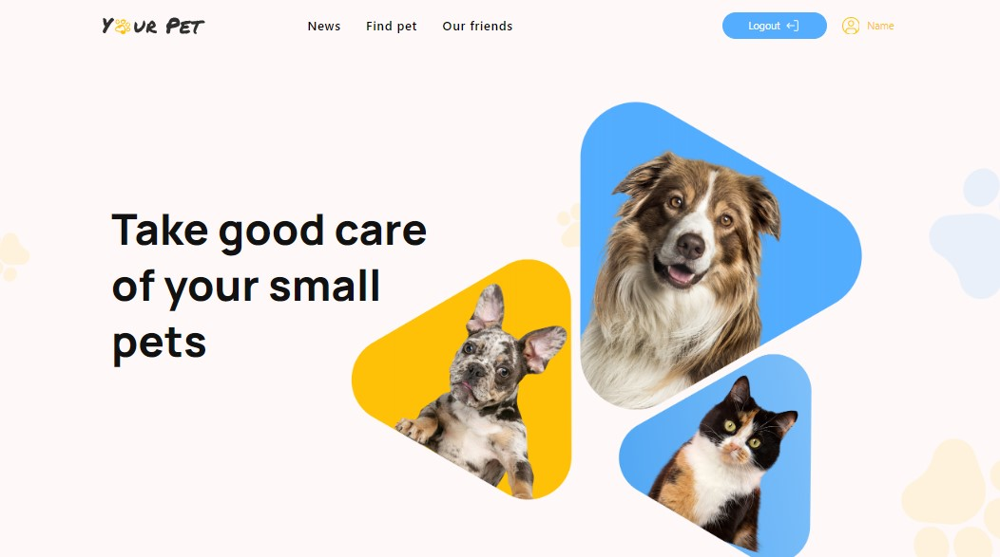

# Your Pets

### Take good care of your small pets

Welcome to our [site](https://borysshabazov.github.io/YourPet/) where you can
post pet loss ads, find pet owners, and post pet-for-sale ads.



## 📃Technologies

- <a href="https://reactjs.org/" target="_blank">![React][React.js]</a>
- <a href="https://tailwindcss.com/" target="_blank">![Tailwind CSS][TailwindCSS.js]</a>
- <a href="https://axios-http.com/ru/" target="_blank">![Axios][Axios.js]</a>
- <a href="https://formik.org/" target="_blank">![Formik][Formik.js]</a>
- <a href="https://github.com/jquense/yup" target="_blank">![Yup][Yup.js]</a>
- <a href="https://date-fns.org/" target="_blank">![Date-fns][Date-fns.js]</a>
- <a href="https://vitejs.dev/" target="_blank">![Vite][Vite.js]</a>

### 💻Collaborators

- [Borys Shabazov](https://github.com/BorysShabazov)
- [Oleksii Khyrshovianu](https://github.com/ToreadorUa)
- [Tanya Pavliuk](https://github.com/Tanyapavliuk)
- [Andrii Kuzhelnii](https://github.com/ribacot)
- [Vova Lyapota](https://github.com/VovaLyapota)
- [Mykola Shein](https://github.com/shein-m)
- [Nikita Salnykov](https://github.com/NikitaSalnykov)
- [Viacheslav Zolotoy](https://github.com/Viacheslav-Zolotoy)
- [Kseniya Pin](https://github.com/KseniyaPin)

## 🥁Getting Started

This is an example of how you may give instructions on setting up your project
locally. To get a local copy up and running follow these simple example steps.

1. Use the LTS version of Node.js.
2. Install the project's basic dependencies with the npm install command.

```sh
 npm install
```

3. Start development mode by running the npm run dev command.

```sh
 npm run dev
```

4. Go to the address indicated in the terminal in the browser.

```sh
$ npm run dev

> react_vite@0.0.0 dev
> vite

VITE v4.5.0  ready in 1099 ms

 Local: http://localhost:5173/YourPet/
```

<!-- LINKS  -->

[React.js]:
  https://img.shields.io/badge/React-20232A?style=for-the-badge&logo=react&logoColor=61DAFB
[TailwindCSS.js]:
  https://img.shields.io/badge/TailwindCSS-06B6D4?style=for-the-badge&logo=tailwindcss&logoColor=FFF
[Axios.js]:
  https://img.shields.io/badge/Axios-FFF?style=for-the-badge&logo=axios&logoColor=5A29E4
[Formik.js]: https://img.shields.io/badge/Formik-172B4D?style=for-the-badge
[Yup.js]: https://img.shields.io/badge/Yup-c458ad?style=for-the-badge
[Date-fns.js]: https://img.shields.io/badge/Date--fns-770c56?style=for-the-badge
[Vite.js]:
  https://img.shields.io/badge/Vite-646CFF?style=for-the-badge&logo=vite&logoColor=646CFF&labelColor=FFF&color=FFF
