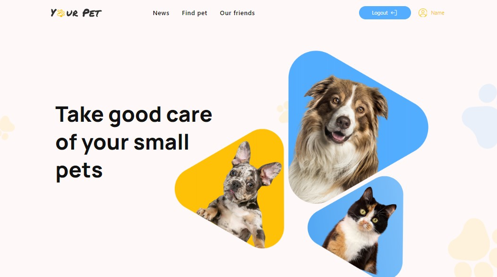

# Ваші домашні тварини

### Дбайте про своїх маленьких домашніх тварин

Ласкаво просимо на наш [сайт](https://borysshabazov.github.io/YourPet/), де ви
можете розміщувати оголошення про втрату домашніх тварин, шукати власників
домашніх тварин і розміщувати оголошення про продаж домашніх тварин.



## 📃Технології

- [![React][React.js]][React-url]
- [![Tailwind CSS][TailwindCSS.js]][Tailwind-url]
- [![Axios][Axios.js]][Axios-url]
- [![Formik][Formik.js]][Formik-url]
- [![Yup][Yup.js]][Yup-url]
- [![Date-fns][Date-fns.js]][Date-fns-url]
- [![Vite][Vite.js]][Vite-url]

## 💻Розробники

- [Borys Shabazov](https://github.com/BorysShabazov)
- [Oleksii Khyrshovianu](https://github.com/ToreadorUa)
- [Tanya Pavliuk](https://github.com/Tanyapavliuk)
- [Andrii Kuzhelnii](https://github.com/ribacot)
- [Vova Lyapota](https://github.com/VovaLyapota)
- [Mykola Shein](https://github.com/shein-m)
- [Nikita Salnykov](https://github.com/NikitaSalnykov)
- [Viacheslav Zolotoy](https://github.com/Viacheslav-Zolotoy)
- [Kseniya Pin](https://github.com/KseniyaPin)

## 🥁Для початку роботи

Це приклад того, як ви можете налаштувати цей проект локально. Щоб запустити
локальну копію, виконайте ці прості кроки.

1. Використовуйте LTS-версію Node.js.
2. Встановіть основні залежності проекту за допомогою команди npm install.

```sh
 npm install
```

3. Запустіть режим розробки, виконавши команду npm run dev.

```sh
 npm run dev
```

4. Перейдіть за адресою, вказаною в терміналі.

```sh
$ npm run dev

> react_vite@0.0.0 dev
> vite

VITE v4.5.0  ready in 1099 ms

 Local: http://localhost:5173/YourPet/
```

<!-- LINKS  -->

[React-url]: https://reactjs.org/
[React.js]:
  https://img.shields.io/badge/React-20232A?style=for-the-badge&logo=react&logoColor=61DAFB
[Tailwind-url]: https://tailwindcss.com/
[TailwindCSS.js]:
  https://img.shields.io/badge/TailwindCSS-06B6D4?style=for-the-badge&logo=tailwindcss&logoColor=FFF
[Axios-url]: https://axios-http.com/ru/
[Axios.js]:
  https://img.shields.io/badge/Axios-FFF?style=for-the-badge&logo=axios&logoColor=5A29E4
[Formik-url]: https://formik.org/
[Formik.js]: https://img.shields.io/badge/Formik-172B4D?style=for-the-badge
[Yup-url]: https://github.com/jquense/yup
[Yup.js]: https://img.shields.io/badge/Yup-c458ad?style=for-the-badge
[Date-fns-url]: https://github.com/jquense/yup
[Date-fns.js]: https://img.shields.io/badge/Date--fns-770c56?style=for-the-badge
[Vite-url]: https://vitejs.dev/
[Vite.js]:
  https://img.shields.io/badge/Vite-646CFF?style=for-the-badge&logo=vite&logoColor=646CFF&labelColor=FFF&color=FFF
